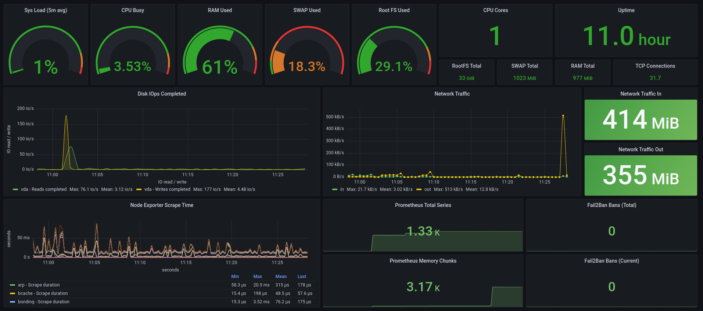
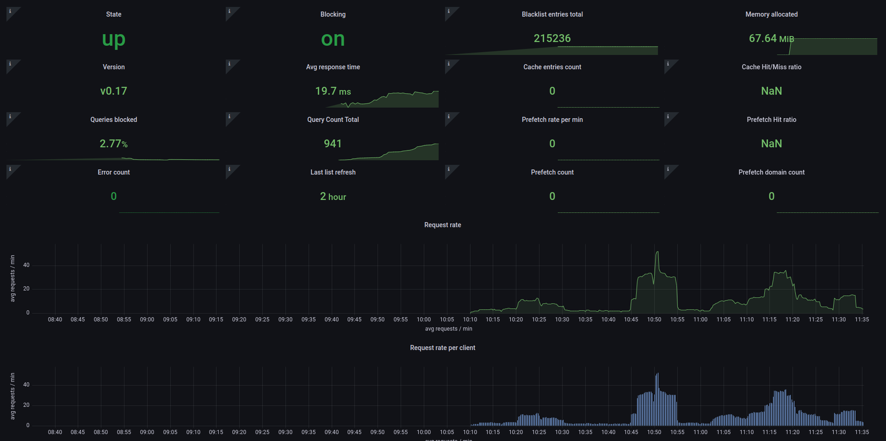

# VPS setup automation

:rocket: This repository contains various tools & scripts
to automate VPS setup. It helps me to setup my personal VPS in any cloud within
30 minutes with all of my favorites self-hosted apps & tools. :rocket:

## Tools & Apps

- **base** - VPS basic setup & enable various securities
- **zsh** - zsh shell with oh-my-zsh theme & plugins
- **docker** - Containerized env
- **postgresql** - PostgreSQL database server
- **mariadb** - MariaDB database server
- **redis** - Redis server
- **nginx** - Nginx web server
- **php** - PHP setup for LEMP stack
- **vaultwarden** - Password manager
- **websites** - Static websites configuration for nginx
- **shiori** - Bookmarks manager
- **firefly3** - Personal finance manager
- **dnote** - Notebook for personal knowledge base
- **focalboard** - Tasks/To-dos/Goals manage in kanban board
- **monica** - Personal CRM
- **blocky** - DNS-proxy with adBlocker
- **wireguard** - Secure & faster VPN
- **backup** - Automated backups for apps & databases
- **monitoring** - System & app monitoring
  - prometheus
  - alert_manager
  - grafana
  - node_exporter
  - fail2ban_exporter

## How to run?

### Spinning up local VM for test only

```bash
vagrant up
vagrant halt
```

### Use **Ansible** provisioner

- Activate venv
  ```bash
  python3 -m venv venv
  cd provisioner/ansible
  source venv/bin/activate
  pip install -r requirements.txt
  ```

> Before run ansible check hosts file vars. i.e: `is_local` & `ansible_host`.
>
> `ansible_host` name should match entry in `~/.ssh/config`

- Now update config in `.env`

  ```bash
  cp .env.example .env
  ```

- Run ansible playbook

  ```bash
  ./ansible-playbook.sh vps-setup.yml --syntax-check
  ./ansible-playbook.sh vps-setup.yml
  ```

- @nsible roles
  ```bash
    - base
    - zsh
    - docker
    - postgresql
    - mariadb
    - redis
    - nginx
    - php
    - vaultwarden
    - websites
    - shiori
    - firefly3
    - dnote
    - focalboard
    - monica
    - blocky
    - wireguard
    - backup
    - monitoring
  ```

## Have a query?

> Just create an issue or e-mail me :)

## Showcase



